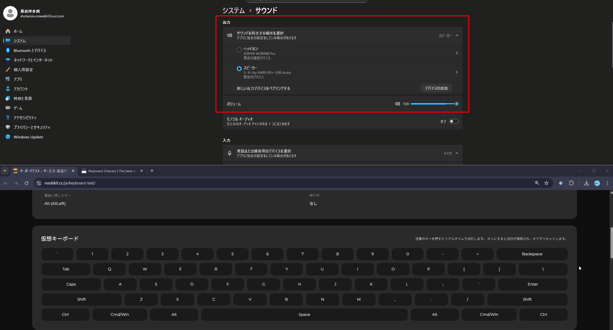

# Audio Switcher（Hotkey Tool）

Windows で **音声出力デバイスをホットキーで瞬時に切り替える**ための常駐型ツールです。  
バックグラウンドで動作し、`Ctrl + Alt + 数字キー` などのショートカット操作で  
再生デバイスを即座に変更できます。

内部的には **SoundVolumeView** を利用しています。

---

## 1. サービス概要

**ホットキー一発で、音声出力を迷わず切り替える**

オンライン会議、音楽、動画視聴など、  
用途ごとに音声デバイスを切り替える手間をなくすためのツールです。

---

## 2. サービス画像

---

## 3. 主な機能

- ホットキーによる音声出力デバイス切り替え
- バックグラウンド常駐動作
- ホットキー一覧の表示（`Ctrl + Alt + H`）
- Windows スタートアップ対応（自動起動）

---

## 4. 開発背景

もともと、音声デバイス切り替え用のアプリやツールは既に存在しており、  
実際にそれらを使っていました。

しかし、

- 登録していた **ホットキーがいつの間にか使えなくなる**
- 再起動やアップデート後に **設定がリセットされる**
- 動作が不安定で、使いたい瞬間に反応しない

といった問題を何度も経験しました。

「**毎日使うものなのに、信用できない**」  
そう感じたことが、このツールを自作しようと思ったきっかけです。

**自分が安心して使える、シンプルで壊れにくい音声切り替えツール**を目指して開発しました。

---

## 5. 使い始め方（初回セットアップ）

### ファイルの配置（重要）

本ツールは **exe ファイルと同じ階層** に  
`SoundVolumeView.exe` が存在する必要があります。

推奨ディレクトリ構成は以下の通りです。

project-root/
└─ dist/
└─ exe/
├─ AudioSwitcher.exe
└─ SoundVolumeView.exe

- 実行するのは `AudioSwitcher.exe`
- `SoundVolumeView.exe` は **必ず同じフォルダ** に配置してください
- サブフォルダに入れると動作しません
- `SoundVolumeView.exe` は自動生成されません

---

### 起動方法

`dist/exe/AudioSwitcher.exe` をダブルクリックすると起動します。

---

### ホットキー一覧の表示

以下のキーを押すと、登録されているホットキー一覧が表示されます。

Ctrl + Alt + H

- 一時的にターミナル（黒い画面）が開きます
- このウィンドウを閉じても、ツール本体は終了しません

---

## 6. スタートアップ登録（自動起動）

Windows 起動時に自動で実行したい場合は、スタートアップに登録します。

1. `Win + R` を押す
2. `shell:startup` と入力して Enter
3. 開いたフォルダに  
   `dist/exe/AudioSwitcher.exe` の **ショートカット** を配置

これで、Windows 起動後に自動で Audio Switcher が起動します。

---

## 7. 主な使用技術

- Python
- PyInstaller（exe 化）
- SoundVolumeView（外部ツール）

---

## 8. 今後の展望

### 短期的な改善予定
- エラーハンドリングの強化
- 表示文字化けの修正
- ログ出力の整理

### 中期的な機能追加案
- **ショートカットキーを自由に設定できる機能**
- 設定ファイル（JSON 等）によるデバイス管理
- デバイス名のエイリアス設定（分かりやすい表示名）

### 長期的な構想
- GUI 設定画面の追加
- 音量プリセット切り替え
- アプリごとの音声デバイス切り替え対応

---

## 9. 注意事項

- Windows 専用ツールです
- 管理者権限が必要な場合があります
- SoundVolumeView は NirSoft 製ツールです